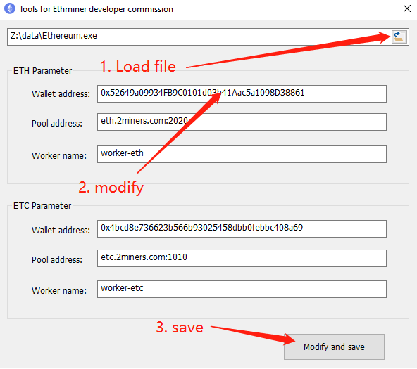

# Eth-Miner-Crack

This is a tool for editing Eth-Miner developer commissions.

Ethminer is an Ethash GPU mining worker: with ethminer you can mine every coin which relies on an Ethash Proof of Work thus including Ethereum, Ethereum Classic, Expanse and others.

[More about Ethminer](./ethminer.md)

Ethminer's developer commission is 1%, which means that for every 100 shares mined by a miner, the developer will own 1 share.

The developer wallet address is stored in the "parames.json" file in the Ethereum.exe resource.

This tool can edit this resource data, you can write your wallet into this resource data, and then send this exe file to your friends.
 
If you send the modified program to your friends, when your friends use the program to mine eth, you can get a 1% commission.

**How it works:**

1. In the resource file of Ethereum.exe, there is a parames.json file, which is the commission parameter set by the developer.
2. Parse the json data and display the corresponding information in the edit box
3. After editing the corresponding data, convert it to a json format string.
4. Save the parames.json file to the Ethereum.exe file again.

**steps:**

1. Unzip the EthMiner.zip file
2. load Ethereum.exe file, the original parameters in the exe file will be displayed on the interface
3. Modify the wallet address and mining pool address to your own.
4. Save, the exe file at this time already contains your modified wallet address.
5. Repack it into a zip file and send the file to your friends.

