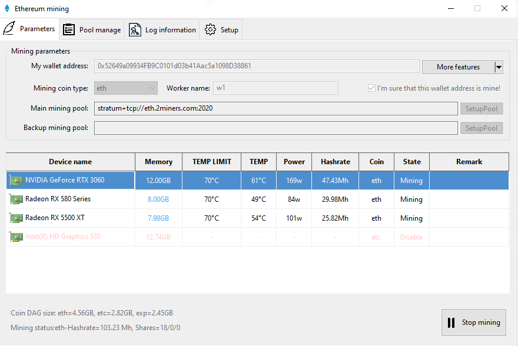
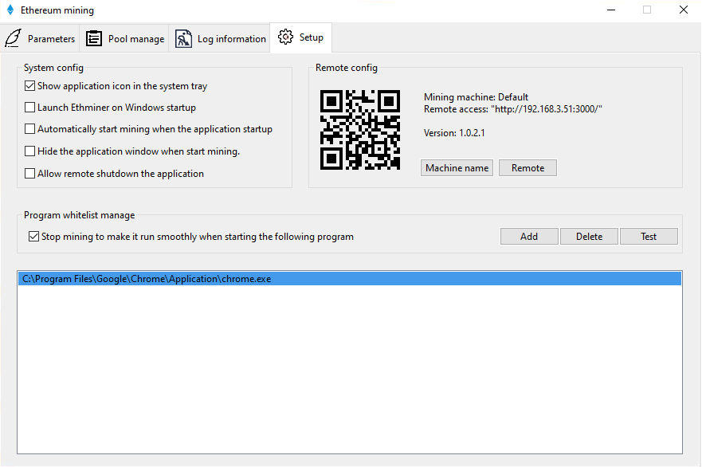
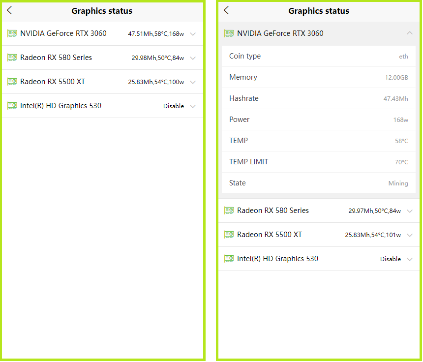

# EthMiner

**Ethminer** is an Ethash GPU mining worker with GUI for windows 10: with ethminer you can mine every coin which relies on an Ethash Proof of Work thus including Ethereum, Ethereum Classic, Expanse and others.

**Features**

1. Built-in **proxy server**, can be used directly in China without VPN.
2. Built-in **whitelist** function, when the programs in the whitelist are started, mining will be automatically suspended. This feature is very effective if you are a gamer.
3. Supports mixed mining of multiple types of graphics cards, and can independently configure the mining currency of the graphics card.
4. Built-in HTTP server, you can remotely monitor your mining machine with your mobile phone.

**Why need it**

1. If you are in china.
2. If you often play games and want to mine at the same time.
3. If you are the owner of an internet cafe. As long as the whitelist is configured, the miner can be started. If you have guests coming to use the computer, the miner will automatically suspend mining

This is the main interface of the program

There are a variety of parameters that can be configured.

If you have multiple computers, please configure the name of the miner to distinguish it when you remote control it.

Real-time log information of mining.

Pool manage.

Remote control with PC.

Remote control with mobile.

Graphics card operating status.

[Back to README](./README.md)